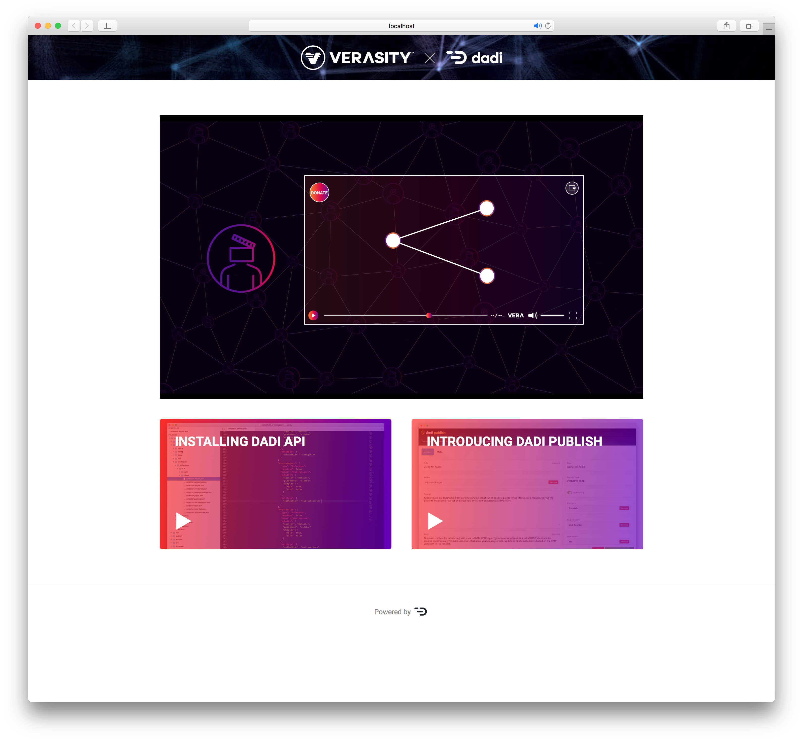

# DADI x Verasity

> Sample application using DADI web services to manage Verasity videos



## Installation

1. Install the applications

    ```
    npm install
    ```

1. Create an oAuth client for API. For the purpose of the demo, choose `vera-client` as the client ID and `vera-secret` as the client secret.

    ```
    cd api
    npm explore @dadi/api -- npm run create-client
    ```

1. Start each app individually

    ```
    # Starting API
    cd api && npm start

    # Starting Publish
    cd publish && npm start

    # Starting Web
    cd web && npm start
    ```

1. Access the website at http://localhost:3080 and the CMS interface at http://localhost:3030.

## About DADI

To learn more about the DADI web services, head to https://dadi.cloud.
